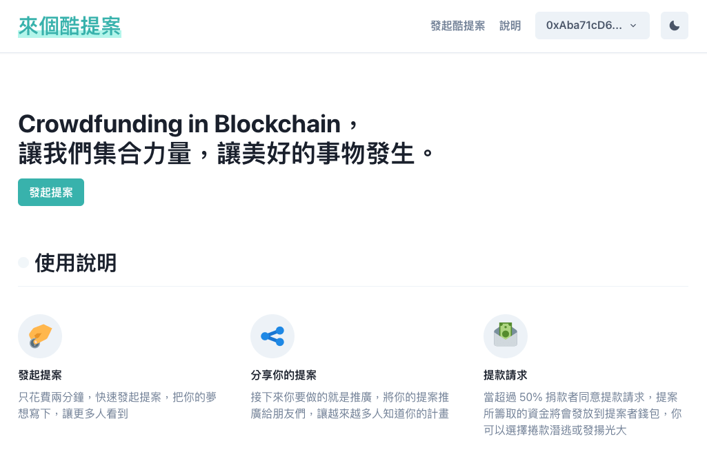
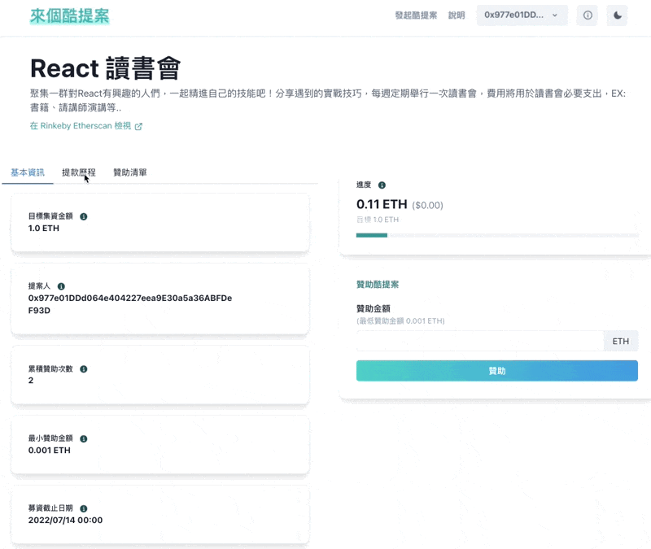

<h1 align="center">
  來點🆒提案
</h1>
<p align="center">Crowdfunding in Blockchain</p>
<p align="center">讓我們集合力量，讓美好的事物發生。</p>

<p align="center">
  
  
</p>

<p align="center">
    <a href="https://cool-proposal.vercel.app/" target="blank">Online Demo</a>
    ·
     <a href="https://ku-ti-an-de-bai-pi-shu.gitbook.io/come-up-with-a-cool-proposal/" target="blank">白皮書</a>
</p>

## 🚤 Introduce 專案簡介
### 👩‍👩‍👧‍👧 來點酷提案吧
Web版群眾集資平台，實現夢想，透過 Web3 與區塊鏈技術，讓金流更透明，需要達到贊助人數 50% 以上同意，提案者才可領取款項。

[🧐 更多說明在白皮書](https://ku-ti-an-de-bai-pi-shu.gitbook.io/come-up-with-a-cool-proposal/)


## 🛠️ 操作教學

### 建立提案
設定提案標題、描述、最小募資金額、目標金額、封面圖片、募資結束時間
- 目標金額需 > 最小募資金額
- 募資結束時間：最多可設定半年，不可設定過去時間

...待補上影片

### 贊助
- 提案者無法贊助，Error：「proposer can't donate」
- 贊助金額必須大於提案設定的「最小募資金額」
- 贊助金額必須 > 0
- 超過募資截止時間，Error：「it already over, can't donate」
- 提案狀態完成，表示募資金額已達標

...待補上影片

### 申請提款
- 必須是提案者錢包，才可申請提款，否則 Error：「Only Proposer can create request.」
- 提案必須達成募款金額，否則 Error：「target not Achieve」
- 該提案合約必須有錢，否則 Error：「The contract has no money」
- 提領金額必須 > 0，否則 Error：「The contract has no money」
- 合約的錢必須 > 提領金額，否則 Error：「insufficient balance」

...待補上影片

### 同意提款
- 錢包必須是贊助過這個提案，才可同意提款，否則 Error：「Only approvers can approve」
- 不可是提案者錢包，否則 Error：「proposal can't approve」
- 此提款已完成，再次同意提款 Error：「proposal is complete」
- 若已同意過，再次同意會 Error：「Only sign once」
- 同意數 >= 贊助人數 50%，合約將自動轉錢給提案者

...待補上影片

### 退款
- 贊助者才能退款，否則 Error：「only sponsor allow refund」
- 提案尚未達成募資金額 && 尚未結束募資，將不可退款，Error：「target to Achieve can't refund」

...待補上影片

## 🛠️ 開發
本專案分為 Solidity 智能合約、前端開發。
- 智能合約：contracts
- 前端Dapp：f2e資料夾

### 📱 Dapp
Install
```bash
$ cd ./f2e
$ yarn install && yarn dev
$ yarn build # 打包
$ yarn start # 屬於 Production 發布使用，執行前需先跑 yarn build
```
📱 開啟 `http://localhost:3000` ，便可看到 Dapp 開發環境<br>
👨🏼‍💻 複製 .env.example，另取名 `.env` 設定 REACT_APP_INFURA_ID [Infura](https://infura.io/) 申請 Project 取得 ID

### 👨‍💻 Solidity
Install
```bash
$ cd batch3-final-project-team-6
$ yarn install
$ npx hardhat node # 啟動 Hardhat 節點 localhost:8545
$ npx hardhat compile
$ npx hardhat run srcripts/deploy.js --network localhost # 部署到本地
$ npx hardhat run srcripts/deploy.js --network rinkeby # 部署到Rinkby測試鏈
```


### 👨‍💻 Develop Contract & Test Connect Contract in Dapp
開發合約及部署，最後在 Dapp 調試步驟

```
1. 在 `contracts` 新增合約 xxx.sol
2. 在 `scripts/deploy` 新增部署
3. $ `npx hardhat run srcripts/deploy.js --network localhost` 部署到本地
4. `f2e/contract/json` 引入合約 Address 及 abi json
5. 在 Dapp `f2e/src` 進行串接調試合約
```

## ☕ 使用技術
**Client:** React 18, Next, chakra-ui, ethers, wagmi, web3, sweetalert2

**Server:** Solidity, Hardhat

## 👨‍💻 Environment Variables

### Frontend
將以下環境變數加到 `f2e/.env` 中，可複製 `f2e/.env.example`

`REACT_APP_INFURA_ID`：請至 `Infura` 註冊取得

### Solidity
複製 `.env.example` 到 `.env` 
`REACT_APP_INFURA_ID`：請至 `ALCHEMY` 註冊取得
`RINKEBY_PRIVATE_KEY`：Rinkby狐狸錢包的私鑰，請從狐狸錢包導出私鑰

.env
```
ALCHEMY_API_KEY=
RINKEBY_PRIVATE_KEY=
```


## ✨ Contributors 
<table>
  <tr>
    <td align="center">
    <a href="https://github.com/hazelwu2">
      
      <br /><sub><b>Hazel</b></sub>
      <br />
      <font size="1">Front-End Developer</font>
    </a>
    </td>
    <td align="center">
    <a href="https://github.com/jimb0xcf">
      
      <br /><sub><b>Jimbo</b></sub>
      <br />
      <font size="1">Front-End Developer</font>
    </a>
    </td>
    <td align="center">
    <a href="https://github.com/pig514dni">
      
      <br /><sub><b>Allen</b></sub>
      <br />
      <font size="1">Solidity Developer</font>
    </a>
    </td>
    <td align="center">
    <a href="https://github.com/junhoulin">
      
      <br /><sub><b>Jim</b></sub>
      <br />
      <font size="1">Whitepaper Writer</font>
    </a>
    </td>
  </tr>
</table>

## ☝ 編輯歷程

|版本|編輯時間|編輯人|說明|
|:---|:---|:---|:---|
|v1|2022/06/11|Hazel|Readme初版|
|v2|2022/06/11|Hazel|更改說明|
|v3|2022/06/13|Hazel|新增Contributors, Env|
|v4|2022/06/18|Hazel|新增情境|

###### tags: `期末報告` `3期第6組`